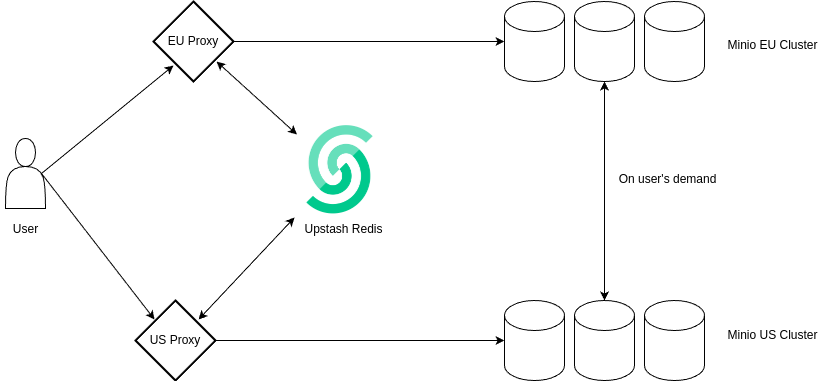

# Project Title: Upstash Object Storage

## Project Overview

In the era of big data, efficient and scalable storage solutions are paramount. Our project, Upstash Object Storage, addresses this need by combining the speed of Redis with the scalability and reliability of MinIO. This hybrid solution offers a unique approach to managing large datasets, ensuring high performance and seamless integration for diverse applications.

## Key Features

### High Performance and Low Latency

By leveraging Redis, an in-memory data structure store, our system provides rapid access to frequently used data, significantly reducing latency and enhancing performance.
The proxy layer ensures that less frequently accessed data is seamlessly offloaded to MinIO, maintaining an optimal balance between speed and storage capacity.